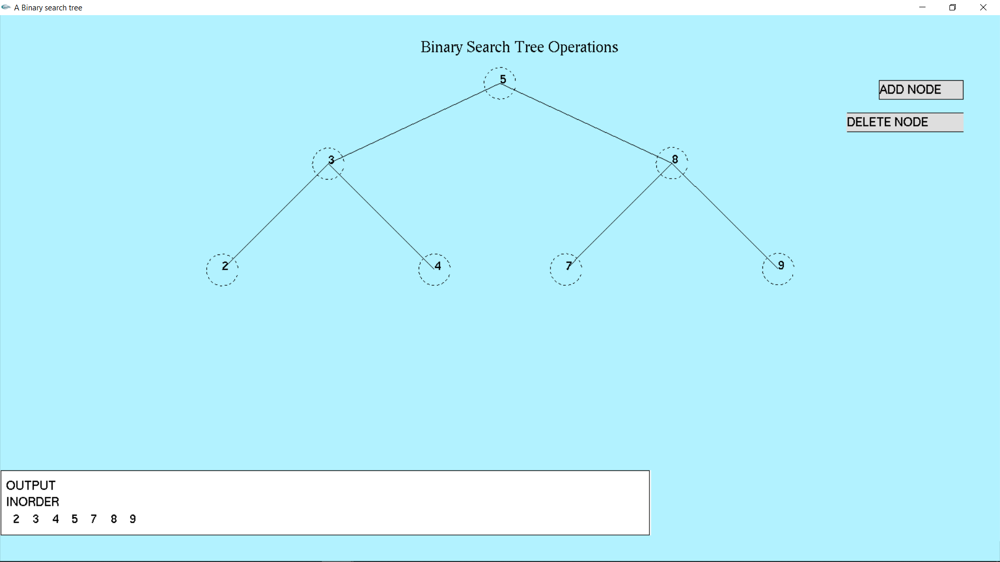

# Binary_Search_Tree-Simulation
This code simulates the behaviour of a binary search tree. It allows the user to add, delete and search for a particular node. It also allows the user to traverse in three different modes, namely, inorder traversal, preorder traversal and postorder traversal.
Make sure appropriate opengl library files( mainly glut.h) are installed for the code to run smoothly. 

